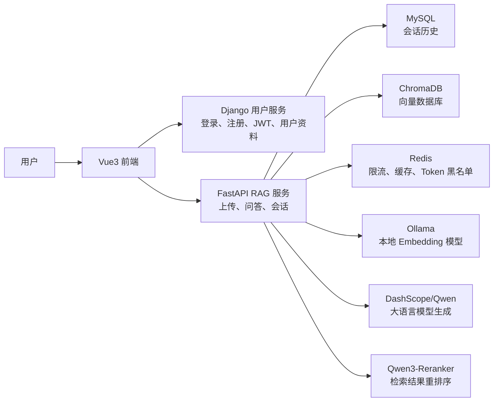
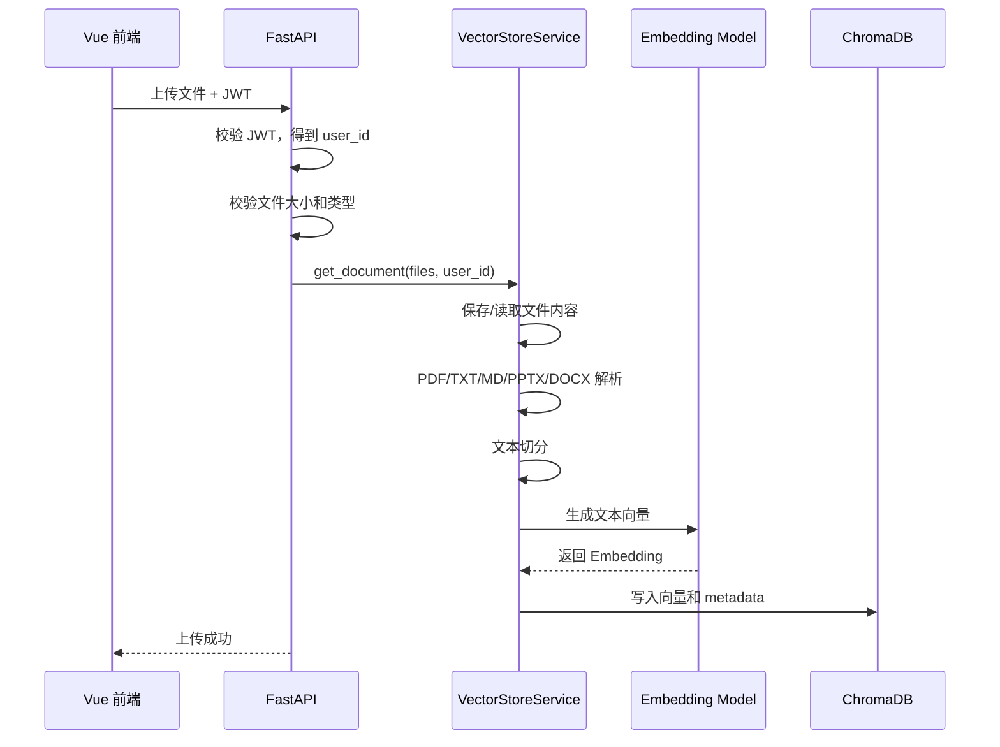
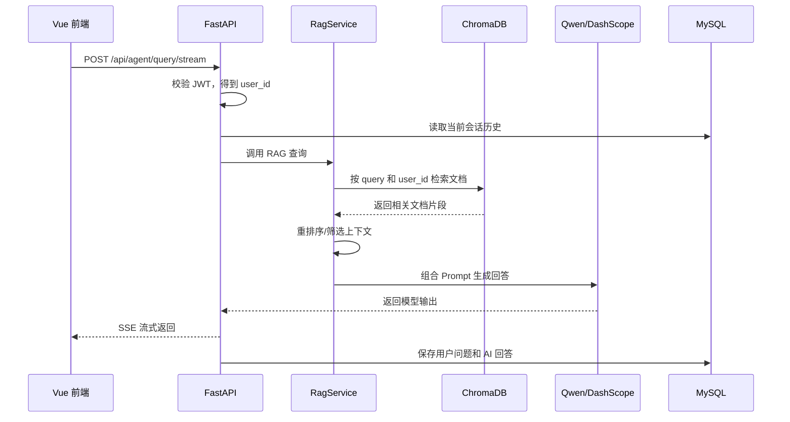

# LangChain RAG FastAPI Service 项目内化文档

这份文档用于把项目整理成可以写进简历、可以在面试中讲清楚的版本。建议你不要逐字背，而是把里面的“项目定位、核心链路、技术取舍、遇到的问题和优化”转成自己的表达。

## 1. 项目一句话介绍

这是一个面向企业知识库问答场景的 RAG 智能对话系统。用户登录后可以上传 PDF、TXT、Markdown、PPTX、DOCX 等资料，系统会把文档切分、向量化并写入向量数据库，用户提问时先从知识库检索相关片段，再结合大语言模型生成回答，同时支持会话历史保存、用户鉴权、限流、资料管理和流式输出。

面试时可以这样说：

> 我做的是一个基于 FastAPI、LangChain、ChromaDB 和 Vue3 的 RAG 知识库问答系统。项目把用户服务、RAG 对话服务和前端界面拆开，用户上传资料后会经过文档解析、文本切分、向量化、检索、重排序和 LLM 生成几个阶段，最终实现基于私有资料的问答。

## 2. 项目解决的问题

传统大模型直接问答有两个问题：

1. 不知道用户上传的私有资料。
2. 容易产生幻觉，回答没有可靠来源。

RAG 的核心思路是：

1. 先把资料变成可检索的知识库。
2. 提问时先从知识库找相关内容。
3. 把相关内容作为上下文交给大模型。
4. 让模型基于上下文回答，而不是凭空回答。

所以这个项目本质上是“私有知识库 + 智能问答 + 用户系统 + 会话系统”的组合。

## 3. 总体架构

项目分成三块：

| 模块 | 目录 | 作用 |
| --- | --- | --- |
| 前端应用 | `front` | Vue3 页面、登录注册、资料上传、AI 对话、会话管理 |
| RAG 对话服务 | `backend` | FastAPI 接口、LangChain RAG、向量库、会话持久化、限流 |
| 用户服务 | `DjangoUserService` | Django 用户注册登录、JWT 签发、用户资料、头像上传 |

整体调用关系：



## 4. 技术栈总结

### 前端

| 技术 | 用途 |
| --- | --- |
| Vue 3 | 构建单页应用 |
| Vite | 前端开发服务器和构建工具 |
| Vue Router | 页面路由、登录态跳转 |
| Pinia | 用户状态、会话状态管理 |
| pinia-plugin-persistedstate | 登录信息持久化 |
| Vant | 移动端/轻量 UI 组件 |
| marked + DOMPurify | Markdown 渲染和 XSS 防护 |
| fetch/SSE | 调用后端接口、接收流式回答 |

前端可以讲的点：

1. 登录态由 Pinia 管理，并通过持久化插件避免刷新丢失。
2. AI 回答使用 SSE 流式输出，用户体验比等完整响应更好。
3. 模型回答支持 Markdown 渲染，同时用 DOMPurify 做安全清洗，避免 XSS。
4. 上传资料、清空向量库、会话列表等操作都通过接口和后端状态保持同步。

### FastAPI RAG 服务

| 技术 | 用途 |
| --- | --- |
| FastAPI | 高性能 Python API 服务 |
| Uvicorn | ASGI 服务运行 |
| Pydantic | 请求/响应数据校验 |
| LangChain | RAG 链、Agent 工具、Prompt 编排 |
| ChromaDB | 本地向量数据库 |
| OllamaEmbeddings | 本地 Embedding 模型 |
| DashScope/Qwen | 大语言模型回答生成 |
| SentenceTransformers CrossEncoder | 文档重排序 |
| SQLAlchemy Async + aiomysql | 异步访问 MySQL，保存会话 |
| Redis | 限流、缓存、Token 黑名单辅助校验 |
| python-magic/unstructured/pypdf | 文件类型识别和文档解析 |

### Django 用户服务

| 技术 | 用途 |
| --- | --- |
| Django | 用户服务主体框架 |
| Django REST Framework | 用户接口 |
| SimpleJWT | JWT 登录鉴权 |
| MySQL | 用户数据存储 |
| Redis/django-redis | 缓存、Token 黑名单 |
| CORS Headers | 允许前端跨域调用 |
| drf-yasg | Swagger API 文档 |

## 5. 核心目录理解

### `backend`

| 路径 | 作用 |
| --- | --- |
| `main.py` | FastAPI 应用入口，注册路由和启动事件 |
| `app/router/chat.py` | AI 对话、RAG、向量库、会话相关 API |
| `app/router/chat_service.py` | 路由和业务逻辑之间的服务层 |
| `app/rag/vector_store.py` | 文档解析、切分、向量化、写入 ChromaDB |
| `app/rag/rag_service.py` | 检索、重排序、调用模型生成回答 |
| `app/rag/reorder_service.py` | 使用 CrossEncoder 对召回文档重排序 |
| `app/agent/agent.py` | Agent 执行器和流式响应逻辑 |
| `app/services/database_session_manager.py` | 会话保存、读取、删除 |
| `app/models/chat_history.py` | 会话表和消息表 SQLAlchemy 模型 |
| `app/utils/auth_utils.py` | 解析 Django JWT，校验当前用户 |
| `app/core/rate_limit.py` | 接口限流 |
| `app/config/*.yaml` | 模型、向量库、Prompt 配置 |

### `DjangoUserService`

| 路径 | 作用 |
| --- | --- |
| `apps/user` | 注册、登录、用户资料、JWT |
| `apps/file` | 头像/文件上传 |
| `DjangoUserService/settings.py` | 数据库、JWT、CORS、中间件配置 |
| `DjangoUserService/urls.py` | Django 路由入口 |

### `front`

| 路径 | 作用 |
| --- | --- |
| `src/views/AIChat.vue` | AI 对话主页面 |
| `src/views/Login.vue` | 登录页面 |
| `src/views/Register.vue` | 注册页面 |
| `src/views/Sessions.vue` | 会话列表 |
| `src/views/My.vue` | 我的/账户页面 |
| `src/store/user.js` | 用户登录态和用户信息 |
| `src/store/session.js` | 会话请求封装 |
| `src/config/api.js` | 前后端接口地址 |
| `vite.config.js` | Vite 代理和开发配置 |

## 6. RAG 核心原理

RAG 全称是 Retrieval-Augmented Generation，中文一般叫“检索增强生成”。它不是直接让大模型回答，而是先检索资料，再把检索结果塞进 Prompt 里，让模型基于资料回答。

### RAG 的四个关键阶段

1. 文档入库
   - 上传文件。
   - 解析成文本。
   - 按固定长度和重叠窗口切分。
   - 调用 Embedding 模型把文本片段转成向量。
   - 存入 ChromaDB。

2. 问题检索
   - 用户输入问题。
   - 把问题转成向量。
   - 在 ChromaDB 中做相似度检索。
   - 找到最相关的若干文档片段。

3. 结果重排序
   - 初次向量召回速度快，但结果可能有噪声。
   - CrossEncoder 会同时看“问题 + 文档片段”，给每个片段重新打分。
   - 取更相关的片段进入最终 Prompt。

4. 生成回答
   - 把用户问题和检索到的上下文组合成 Prompt。
   - 调用 Qwen/DashScope 生成答案。
   - 通过 SSE 流式返回给前端。

### 为什么要切分文档

大模型和向量检索都不适合直接处理很长的原文。切分可以带来几个好处：

1. 降低单个片段长度，便于 Embedding。
2. 提升检索粒度，只找相关段落，不把整篇文档都塞给模型。
3. 通过 `chunk_overlap` 保留上下文连续性，减少句子被切断导致的语义损失。

当前项目的配置：

```yaml
chunk_size: 200
chunk_overlap: 20
k: 5
```

面试可以解释为：每次检索返回前 5 个候选片段，文档切分时保留一定重叠，兼顾上下文完整性和检索效率。

## 7. 资料上传流程

用户上传资料后，后端大致流程是：



可以重点讲 metadata：

1. `user_id` 用于区分不同用户的知识库。
2. `file_id` 用于追踪上传资料。
3. `source_filename` 用于展示原始文件名。
4. `md5` 用于避免重复入库。

这也是你当前项目优化时最重要的方向：上传资料不能只写入向量库，还要保留“用户上传了什么文件”的记录，否则前端无法展示和访问上传资料。

## 8. 问答流程

用户提问时，完整链路如下：



面试重点：

1. JWT 里取 `user_id`，保证用户只能查自己的资料。
2. 查询前先走向量库检索，避免模型脱离资料直接回答。
3. 生成结果保存到 MySQL，支持历史会话回放。
4. 前端通过 SSE 接收增量回答，用户体验更接近 ChatGPT。

## 9. 会话持久化设计

FastAPI 服务使用 SQLAlchemy Async 连接 MySQL，核心表：

### `chat_sessions`

| 字段 | 作用 |
| --- | --- |
| `id` | 会话 ID |
| `user_id` | 用户 ID |
| `title` | 会话标题 |
| `metadata` | 扩展信息 |
| `created_at` | 创建时间 |
| `updated_at` | 更新时间 |

### `chat_messages`

| 字段 | 作用 |
| --- | --- |
| `id` | 消息 ID |
| `session_id` | 所属会话 |
| `role` | user/assistant |
| `content` | 消息内容 |
| `metadata` | 扩展信息 |
| `created_at` | 创建时间 |

为什么会话单独放 MySQL，而不是放向量库：

1. 会话是结构化业务数据，适合关系型数据库。
2. 向量库适合语义检索，不适合做事务型业务查询。
3. 会话需要按用户、时间、会话 ID 查询，MySQL 更直接。

## 10. 鉴权设计

项目采用 Django 负责登录和 JWT 签发，FastAPI 负责解析 JWT。

流程：

1. 用户在前端登录。
2. Django 校验账号密码，返回 JWT。
3. 前端把 JWT 存入 Pinia/localStorage。
4. 调用 FastAPI 时在请求头带上 `Authorization: Bearer <token>`。
5. FastAPI 使用同一套 `SECRET_KEY` 和 `ALGORITHM` 解析 token。
6. 解析出 `user_id` 后用于会话隔离和知识库隔离。

可以讲的安全点：

1. FastAPI 不信任前端传来的用户 ID，而是从 JWT 中解析。
2. Redis 可以记录 Token 黑名单，用户退出后让旧 Token 失效。
3. 路由层用依赖注入 `Depends(get_current_user_id)` 统一做鉴权。

## 11. 限流和缓存

后端使用 Redis 做两类事情：

1. 接口限流
   - 防止用户短时间内大量请求模型接口。
   - 降低模型 API 成本。
   - 保护服务稳定性。

2. 用户信息/Token 状态缓存
   - FastAPI 可以从 Redis 查用户信息或 Token 黑名单。
   - 减少频繁调用 Django 用户服务。

面试可以这样说：

> 我把用户身份认证和业务接口拆开，但 FastAPI 每次请求仍需要确认用户身份，所以用了 JWT + Redis 的方式。JWT 负责无状态认证，Redis 负责缓存和黑名单，兼顾性能和可控性。

## 12. Agent 和 RAG 的关系

项目中有 Agent 模块，它可以把 RAG、天气、时间、用户信息等封装成工具，让模型决定调用哪个工具。

但在知识库问答场景中，有一个重要问题：

如果完全让 Agent 自己决定是否调用 RAG 工具，模型可能绕过检索直接回答，导致回答没有经过数据库。

更稳的设计是：

1. 对“知识库问答”主入口，强制先走 RAG 检索。
2. 对开放式助手能力，再使用 Agent 工具调用。
3. 对用户上传资料类问题，检索结果为空时明确告诉用户没有查到资料，而不是编答案。

这个点很适合面试讲成优化经历：

> 我在调试时发现 Agent 虽然提示词要求优先调用 RAG，但模型并不保证每次都调用工具。为了保证知识库问答的可靠性，我把主聊天链路改成显式调用 RagService，也就是先按 user_id 检索向量库，再把上下文交给模型生成答案。这样牺牲了一点 Agent 的自由度，但换来了业务一致性和可解释性。

## 13. 关键技术原理

### Embedding

Embedding 是把文本映射成向量。语义相近的文本，向量距离也更近。

例子：

1. “怎么启动项目”
2. “本地运行步骤是什么”

这两句话字面不完全一样，但语义接近，向量距离会比较近，因此可以被检索到。

### 向量检索

ChromaDB 存储每个文档片段的向量。查询时，把问题也变成向量，然后计算相似度，找出最接近的文档片段。

### 重排序

向量检索偏召回，可能把“看起来相关但不精确”的片段找出来。CrossEncoder 会对“问题 + 文档片段”进行更细粒度评分，把真正相关的内容排到前面。

### Prompt 组装

RAG 不是把所有资料都交给模型，而是只把检索到的片段作为上下文：

```text
用户问题：...

参考资料：
片段 1：...
片段 2：...
片段 3：...

请只根据参考资料回答。
```

这样能减少幻觉，也能节约 Token。

### SSE 流式输出

SSE 是 Server-Sent Events，适合服务端持续向浏览器推送文本。

在本项目中：

1. 前端发起一次 POST 请求。
2. 后端返回 `text/event-stream`。
3. 模型生成一点，后端就推送一点。
4. 前端逐步追加到聊天气泡里。

好处是用户不用等完整回答生成完。

## 14. 可写进简历的版本

### 简历项目描述

基于 Vue3 + FastAPI + Django + LangChain 构建企业知识库 RAG 智能问答系统，支持用户登录、资料上传、文档解析、向量化检索、重排序、流式问答和会话持久化。系统采用前后端分离和服务拆分架构，Django 负责用户认证与 JWT 签发，FastAPI 负责 RAG 问答和向量库管理，前端通过 SSE 实现模型回答的流式展示。

### 简历要点

1. 设计并实现 RAG 问答链路：文档解析、文本切分、Embedding 向量化、ChromaDB 检索、CrossEncoder 重排序、LLM 生成回答。
2. 使用 FastAPI + LangChain 封装问答服务，结合 Pydantic、依赖注入和路由分层提升接口可维护性。
3. 使用 Django REST Framework + SimpleJWT 构建用户服务，FastAPI 解析 Django JWT 实现跨服务鉴权。
4. 使用 MySQL 保存会话和消息历史，支持按用户隔离的会话查询、删除和回放。
5. 使用 Redis 实现接口限流、Token 黑名单和用户信息缓存，提升系统稳定性和安全性。
6. 使用 Vue3 + Pinia + Vue Router 构建前端，支持登录态持久化、资料上传、会话管理和 SSE 流式响应。
7. 优化知识库问答可靠性，将主聊天入口调整为显式 RAG 检索后生成，避免模型绕过知识库直接回答。

## 15. 面试讲解模板

### 版本 1：一分钟介绍

这个项目是一个基于 RAG 的知识库问答系统，整体分成 Vue 前端、FastAPI RAG 服务和 Django 用户服务。用户登录后可以上传资料，后端会解析文档、切分文本、调用本地 Embedding 模型生成向量，并存入 ChromaDB。用户提问时，FastAPI 会根据 JWT 里的 user_id 查询当前用户的知识库，检索相关文档片段，再通过重排序筛选上下文，最后调用 Qwen 大模型生成回答，并通过 SSE 流式返回给前端。会话历史会保存到 MySQL，Redis 用来做限流、缓存和 Token 黑名单。

### 版本 2：三分钟展开

我把项目理解成一个企业内部知识库助手。它解决的问题是：大模型本身不知道企业内部资料，而且直接回答容易幻觉，所以用 RAG 把私有资料接入模型。

架构上分三层：前端是 Vue3，负责登录、上传资料、聊天界面和流式展示；用户服务是 Django，负责账号、JWT 和用户资料；核心 AI 服务是 FastAPI，负责资料入库、向量检索、RAG 生成和会话保存。

资料入库时，后端会先校验文件类型和大小，然后根据文件类型调用不同 loader 解析内容，再用文本切分器切成 chunk，调用 Ollama 的 Embedding 模型转成向量，最后写入 ChromaDB。每个 chunk 会带上 user_id、文件名等 metadata，保证用户之间的数据隔离。

提问时，前端带着 JWT 调 FastAPI，FastAPI 解析出 user_id，先从当前用户的向量库里检索 top-k 片段，再用 reranker 重排序，然后把最相关的上下文和问题拼成 Prompt 调大模型。生成结果通过 SSE 返回前端，同时保存到 MySQL 的会话表和消息表里。

我觉得这个项目比较有价值的点是，它不是单纯调模型 API，而是完整串起了用户系统、文档处理、向量数据库、检索增强、流式输出和会话持久化。

## 16. 面试高频问题和回答

### Q1：为什么要用 RAG，不直接把问题丢给大模型？

因为大模型不知道用户上传的私有资料，而且直接回答容易幻觉。RAG 先从知识库检索相关上下文，再让模型基于上下文回答，可以提升准确性、可追溯性，也能降低把整篇文档塞进上下文的 Token 成本。

### Q2：为什么用 ChromaDB？

ChromaDB 是轻量级本地向量数据库，适合本地开发和中小规模知识库场景。它能持久化向量、metadata 和文档内容，并提供相似度检索能力。相比自己用 MySQL 存向量，ChromaDB 的检索接口更直接，和 LangChain 集成也更方便。

### Q3：文档为什么要切分？

长文档直接向量化会丢失细节，检索粒度也太粗。切分成 chunk 后，每个片段都可以独立检索。设置 overlap 是为了避免句子或段落边界被切断，保留上下文连续性。

### Q4：Embedding 模型和大语言模型分别做什么？

Embedding 模型负责把文本变成向量，用于语义检索；大语言模型负责基于检索到的上下文生成自然语言回答。Embedding 解决“找资料”，LLM 解决“组织答案”。

### Q5：重排序有什么用？

向量检索速度快，但结果可能不够精准。重排序模型会重新判断 query 和每个候选文档的相关性，把最相关的片段排到前面。这样可以提高最终回答质量，减少无关上下文干扰。

### Q6：怎么保证用户只能访问自己的资料？

前端请求时带 JWT，FastAPI 从 JWT 中解析 user_id，而不是相信前端传参。文档入库时把 user_id 写入 metadata，检索时按 user_id 过滤，查询会话时也按 user_id 校验。

### Q7：为什么用户服务用 Django，RAG 服务用 FastAPI？

Django 适合快速搭建用户系统、后台管理、认证和数据库模型；FastAPI 更适合高性能 API、异步请求、流式响应和 AI 服务编排。两者拆开后职责清晰，也更接近微服务架构。

### Q8：为什么用 SSE 而不是普通 HTTP？

普通 HTTP 要等完整回答生成完才返回，用户等待时间长。SSE 可以让后端边生成边推送，前端逐字或分段显示，体验更好。相比 WebSocket，SSE 对单向流式文本更简单。

### Q9：Redis 在项目里有什么作用？

主要用于接口限流、用户信息缓存和 Token 黑名单。限流可以保护模型接口和后端服务，缓存可以减少跨服务请求，黑名单可以让退出登录后的 Token 失效。

### Q10：你优化过什么问题？

可以讲这几个：

1. 修复本地运行环境问题，例如 `uv` 环境、Ollama、libmagic、MySQL migration。
2. 优化前端界面，把原本默认接口页改成真正的 RAG Workspace。
3. 发现 Agent 可能没有强制走知识库检索，优化为主聊天链路显式调用 RAG。
4. 发现上传资料缺少可追踪记录，优化方向是把上传文件和向量库 metadata 关联起来，让前端能展示用户上传过的资料。

## 17. 项目亮点

### 亮点 1：完整 RAG 链路

不是简单调用大模型，而是实现了文档解析、切分、向量化、检索、重排序、Prompt 生成和流式输出。

### 亮点 2：服务拆分清晰

Django 管用户，FastAPI 管 AI，Vue 管交互。每个服务职责明确，便于维护和扩展。

### 亮点 3：用户级数据隔离

通过 JWT 获取 user_id，在会话和向量库层面都做用户隔离，适合多用户知识库场景。

### 亮点 4：会话持久化

用户每次提问和 AI 回答都会存入 MySQL，支持历史会话回放，而不是一次性聊天。

### 亮点 5：工程化能力

项目包含环境变量、配置文件、日志、限流、缓存、Swagger、前后端代理、依赖管理等工程化要素。

## 18. 可以继续优化的方向

这些可以在面试中作为“我后续会怎么做”的回答：

1. 上传文件可观测性
   - 保存上传文件记录。
   - 展示文件状态：解析中、已入库、失败。
   - 支持删除单个文件。

2. 检索可解释性
   - 回答中展示引用来源。
   - 返回命中文档片段和相似度。
   - 支持点击查看原文。

3. RAG 质量优化
   - 调整 chunk size 和 overlap。
   - 增加 Hybrid Search：向量检索 + BM25。
   - 引入 reranker 缓存，减少重复计算。
   - 对不同文件类型做更细的清洗策略。

4. 权限优化
   - 知识库按用户、团队、项目分层。
   - 管理员可以共享资料。
   - 文档级权限控制。

5. 部署优化
   - Docker Compose 管理 MySQL、Redis、FastAPI、Django、前端。
   - Nginx 反向代理。
   - 生产环境关闭 debug 和 SQL echo。
   - 日志接入 ELK 或云日志。

6. 异步任务优化
   - 大文件上传后不阻塞请求。
   - 用 Celery/Redis Queue 后台解析和入库。
   - 前端轮询或 WebSocket/SSE 显示入库进度。

## 19. 面试时要避免的坑

1. 不要只说“我用了 LangChain”
   - 要讲清楚 LangChain 在项目里负责 Prompt、Retriever、Chain、Agent 工具编排。

2. 不要说“向量数据库就是数据库”
   - 它主要解决语义检索，不替代 MySQL 这种关系型业务数据库。

3. 不要说“RAG 完全不会幻觉”
   - 更准确的说法是 RAG 可以显著降低幻觉，但仍需要 Prompt 约束、引用来源和空检索处理。

4. 不要把 Agent 和 RAG 混为一谈
   - RAG 是检索增强生成流程。
   - Agent 是让模型选择工具和规划步骤的机制。
   - 知识库问答场景通常要强制 RAG，不能完全依赖 Agent 自觉调用工具。

5. 不要忽略权限隔离
   - 多用户知识库最重要的是 user_id metadata 和接口鉴权。

## 20. 你可以怎么把它讲成自己的项目

建议按这个顺序准备：

1. 先能手画架构图
   - Vue 前端
   - Django 用户服务
   - FastAPI RAG 服务
   - MySQL、Redis、ChromaDB、Ollama、DashScope

2. 再能手写 RAG 流程
   - 上传
   - 解析
   - 切分
   - Embedding
   - 入库
   - 检索
   - 重排序
   - 生成
   - 保存会话

3. 准备两个真实问题
   - 为什么回答没走知识库：Agent 不一定调用工具，所以改成显式 RAG。
   - 为什么上传后看不到资料：只入了向量库，没有维护用户文件记录，所以要保存文件 registry 和 metadata。

4. 准备一个优化故事
   - 发现问题。
   - 定位到模块。
   - 解释原因。
   - 说明改法。
   - 讲改完后的收益。

## 21. 推荐面试表达

如果面试官问“这个项目你主要负责什么”，可以这样回答：

> 我主要负责把项目在本地跑通，并围绕 RAG 问答链路做梳理和优化。包括配置 Ollama 本地 Embedding、DashScope 大模型、MySQL/Redis 环境，理解并调整 FastAPI 的资料上传、向量入库、会话保存和流式问答流程。同时我也重构了前端交互，把原来的接口展示改成更像知识库工作台的聊天界面。调试过程中我重点解决了两个问题：一个是回答可能绕过知识库直接生成，另一个是上传资料缺少可访问记录。我的优化思路是让主聊天入口显式走 RAG 检索，并为上传文件建立用户维度的文件记录和 metadata。

如果面试官问“你觉得最难的地方是什么”，可以这样回答：

> 最难的不是单独调通模型，而是把用户、资料、向量库、会话和权限串起来。比如上传资料后，不仅要让文本进入 ChromaDB，还要保留 user_id、文件名、文件 ID 等 metadata；提问时也不能只看 query，还要按当前登录用户过滤知识库。否则系统看起来能回答，但实际上不具备多用户知识库的可靠性。

## 22. 一句话总结

这个项目可以包装成：

> 一个具备用户体系、文档入库、向量检索、重排序、流式生成和会话持久化能力的企业级 RAG 知识库问答系统。

